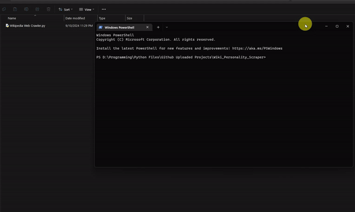

# Wikipedia Scraper

This repository contains a Python script for scraping information from Wikipedia. The script retrieves the title, a few paragraphs, and any associated image of a Wikipedia page based on user input.

## Features

- **Title Extraction**: Retrieves the main title of the Wikipedia page.
- **Paragraph Extraction**: Fetches the first few paragraphs of the page content.
- **Image Extraction**: Downloads and displays the first image found in the infobox of the page.

## Requirements

- `numpy`
- `opencv-python`
- `beautifulsoup4`
- `html`
- `urllib`
- `xml.etree.ElementTree`

## Usage

1. **Clone the repository**:
    ```bash
    git clone https://github.com/yourusername/wikipedia-scraper.git
    ```

2. **Install the required packages**:
    ```bash
    pip install numpy opencv-python beautifulsoup4
    ```

3. **Run the script**:
    ```bash
    python wikipedia_scraper.py
    ```

4. **Input**: Enter the name of the Wikipedia page you want to scrape when prompted.

## Sample Work:

## Example

```python
Name Personality: Shah_Rukh_Khan
